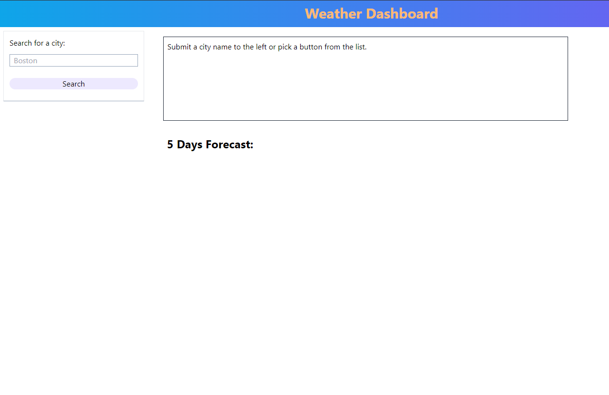
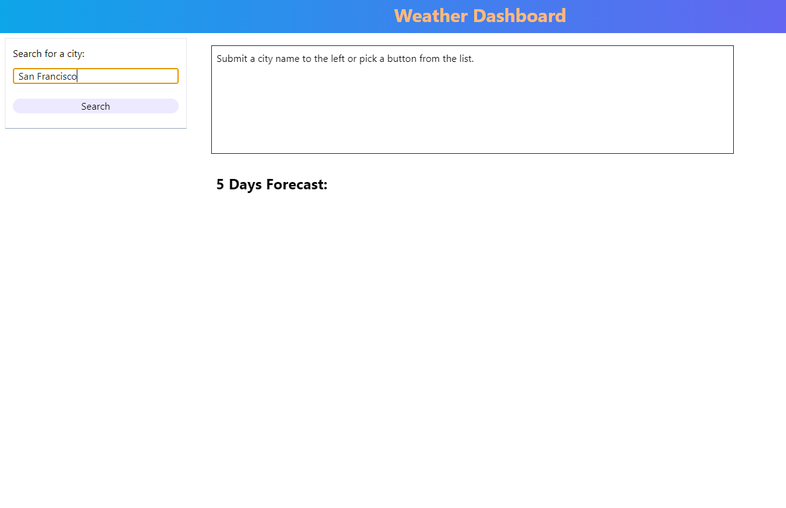
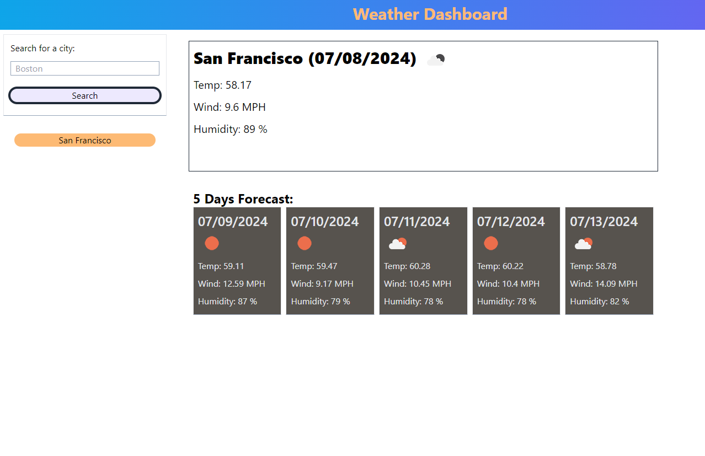
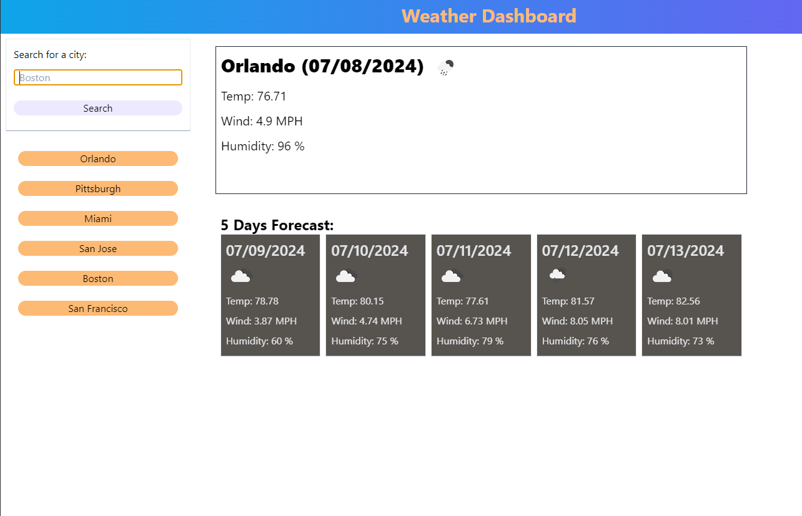
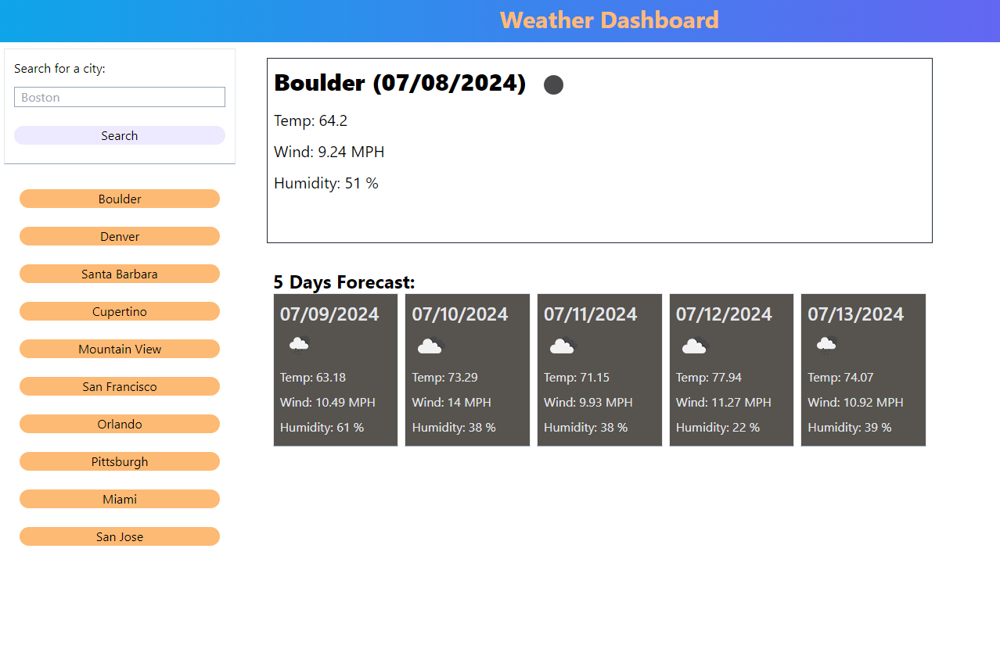

# weather-dashboard-OpenWeather
A weather forecast dashboard based on [OpenWeather](https://openweathermap.org/api).

## Project Title: 
Weather Dashboard by OpenWeather API

## Description:
The dashboard would take user input as city names, covert it to geocode, and provide weather and 5 days forecast based on the geocode.  If it's a valid city name or a geocode is found for the input, a button would show up on the left nav bar as quick access.  Up to 10 buttons will be available.  The order of the button is based on recency.  Button data is stored in localstorage.

**Note1:** Styled with [Tailwind CSS](https://tailwindcss.com/), therefore there is a tailwind.config.js in the root folder as the tailwind config file for Tailwind CLI to generate ./assets/css/style.css.  ./assets/css/input.css is used per Tailwind CLI for CSS generation purpose but not used in the actual page. 

**Note2:** The dashboard is not optimized for different screen sizes and is only suitable for XL view width.  So use your lovely HD+ screen then.

## Usage:
open https://momokokong.github.io/weather-dashboard-OpenWeather/ directly from a browser.  Start with an valid city name and the gray "Search" button on the left.

## Screenshot:
Landing page:  

Start the weather forecast from the search form on the left:  

Forecast on the right:  

Quick access on the lef, order by recency:  

Up to 10 quick access buttons:  

## Contributing:
Let me know if there are any tips to improve the page

## License: 
MIT 

## Contact:
[LinkedIn](https://www.linkedin.com/in/poshinhuang/)
